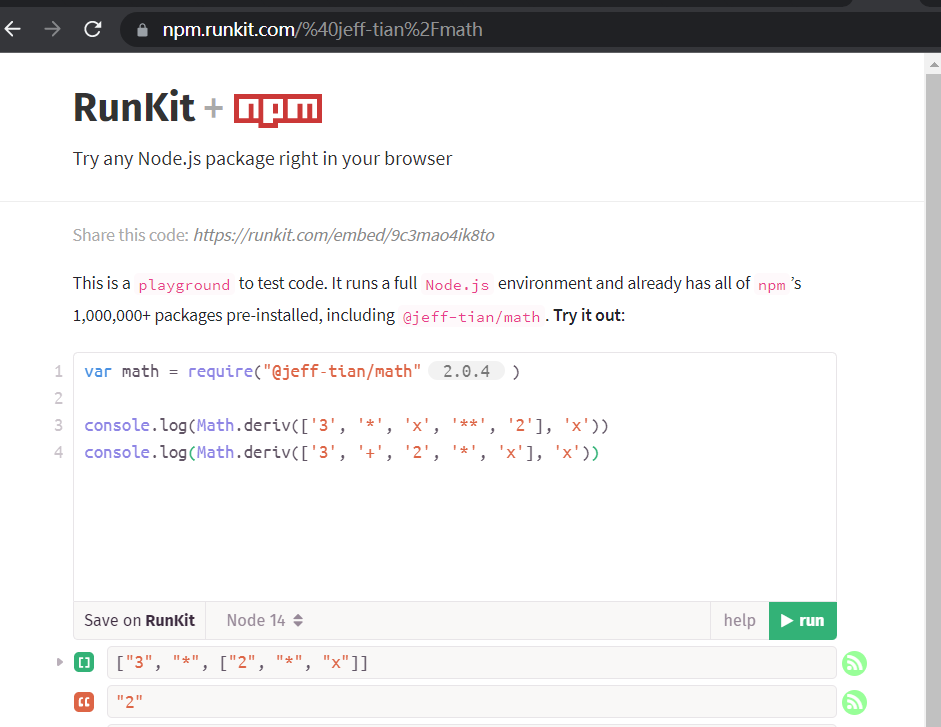

# `@jeff-tian/math`

---

> 一个 js 数学包。

## 功能

- 计算导数（微分）
    - $$\frac{dc}{dx} =0 当c是一个常量，或者一个与x不同的变量$$
    - $$\frac{dx}{dx}=1$$
    - $$\frac{d(u+v)}{dx}=\frac{du}{dx}+\frac{dv}{dx}$$
    - $$\frac{d(uv)}{dx}=u(\frac{dv}{dx})+v(\frac{du}{dx})$$
    - $$\frac{d(u^n)}{dx}=nu^{n-1}(\frac{du}{dx})$$

## 使用方法

```
var math = require("@jeff-tian/math")

console.log(Math.deriv(['x'], 'x'))
console.log(Math.deriv(['3', '*', 'x', '**', '2'], 'x'))
```

在线尝试： https://npm.runkit.com/%40jeff-tian%2Fmath



## 谁在使用

- [极客计算器](https://jiy.azurewebsites.net/zh-CN/GeekCalculator?fns=base64%25252FWyJcXGZyYWN7ZFxcbGVmdCh4XjJcXHJpZ2h0KX17ZHh9IiwiXFxmcmFje2RcXGxlZnQoMnhcXHJpZ2h0KX17ZHh9IiwiXFxmcmFje2RcXGxlZnQoeF4zXFxyaWdodCl9e2R4fSIsIlxcZnJhY3tkXFxsZWZ0KHgreVxccmlnaHQpfXtkeH0iLCJcXGZyYWN7ZFxcbGVmdCgzeF4yXFxyaWdodCl9e2R4fSIsIlxcZnJhY3tkXFxsZWZ0KHgrM1xcbGVmdCh4K1xcbGVmdCh5KzJcXHJpZ2h0KVxccmlnaHQpXFxyaWdodCl9e2R4fSJd)


## 开发过程（局部）

https://www.zhihu.com/zvideo/1515080556539256832